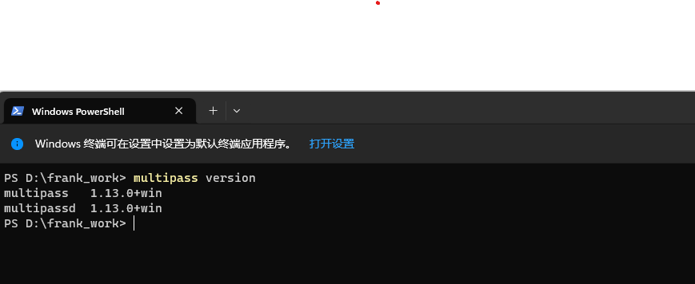

# Create a K8S in local 

## Windows

### Preparation
1. Download the docker Desktop
2. Download the multipass
3. Download the VirtualBox

### Create the clust
1. Check the version of multipass
    ```shell
   multipass version
    ```
   
2. Create the node
   ```commandline
    multipass launch --name master --cpus 2 --memory 4G --disk 5G
   ```

## Linus
