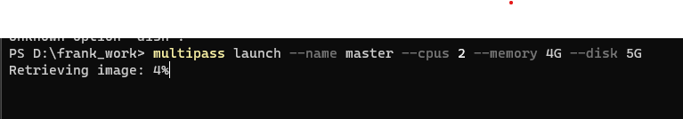
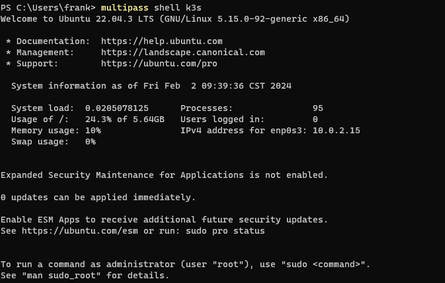
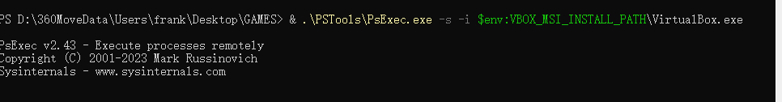
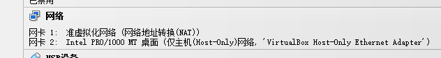
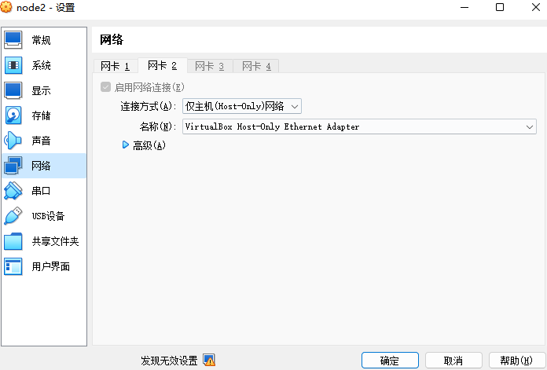
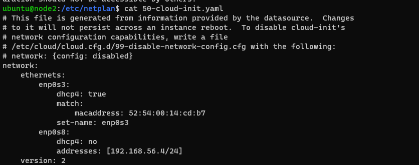
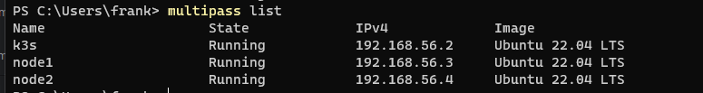
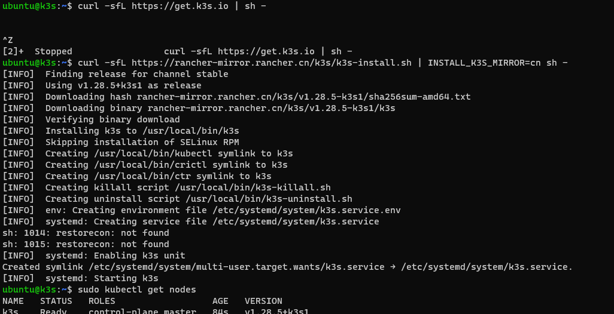

# Create a K8S in local 

## Windows

### Preparation
1. Download the docker Desktop
2. Download the multipass
3. Download the VirtualBox

### Create the clust
1. Check the version of multipass
    ```shell
   multipass version
    ```
   
2. Create the node
   ```commandline
    multipass launch --name master --cpus 2 --memory 4G --disk 5G
   ```
   
3. Login the instance
      ```commandline
    multipass shell k3s
   ```
   
 
4. Windows need to address some issue
   
   
   1. enable the virtualbox network 
      1. 
      2. 
   2. change the config in linux 
      1. ```cd /etc/netplan```
      2. ```sudo cp old.yaml old_bac.yaml```
      3. ```sudo vi xxx.yaml```
      4. ```sudo netplan apply```
   3. finish_init_cluster.png 
   Please check this : [https://multipass.run/docs/set-up-the-driver#heading--windows-use-virtualbox](https://multipass.run/docs/set-up-the-driver#heading--windows-use-virtualbox)
   
5. Install the K3s 
   
   ```curl -sfL https://rancher-mirror.rancher.cn/k3s/k3s-install.sh | INSTALL_K3S_MIRROR=cn sh -```

## Linus( This would be much easier than windows)
